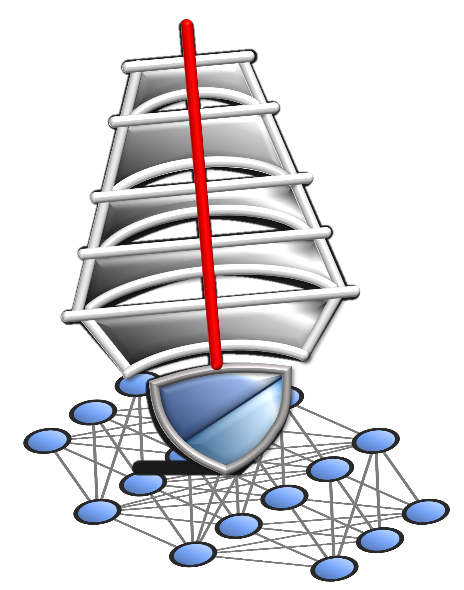

# DeepMainMast



This repository contains the code implementation of "paper name and link". There are two folders i) dmmsinglechain supportd single chain protein maps ii) dmmmultichain supports multi chain protein maps.

## Dependencies

Use the requirements.txt file and install packages using pip as follows. There are same requirements for both single chain and multi-chain.

```
pip install -r requirements.txt
```

Then install BioTEMPy package using pip. Installing it separately is crucial because it has dependecy conflicts with bio package. Hence after installing all packages
using requirements.txt, we then separately install BioTEMPy using pip as follows

```
pip install BioTEMPy
```

## How to run?

First please choose a pipeline that will be the most suitable for your EM Map. There are two pipelines 1) Single chain and 2) Multi-chain. 

Next, follow the details for each pipeline by reading the readme files inside the respective folders for next steps. 

1) [Single Chain Deep MainMast](https://github.com/kiharalab/DeepMainMast/tree/main/dmmsinglechain) 

2) [Multi Chain Deep MainMast](https://github.com/kiharalab/DeepMainMast/tree/main/dmmmultichain)

## Other easier ways to run quickly

Code Ocean Capsule:
- [Single Chain](https://codeocean.com/capsule/0866386/tree)
- [Multi Chain](https://codeocean.com/capsule/9358532/tree)

Colab Notebooks:
- [Single Chain](https://colab.research.google.com/github/kiharalab/DeepMainMast/blob/main/DeepMainMast_Single_chain.ipynb)
- [Multi Chain](https://colab.research.google.com/github/kiharalab/DeepMainMast/blob/main/DeepMainMast_Multi_chain.ipynb)
